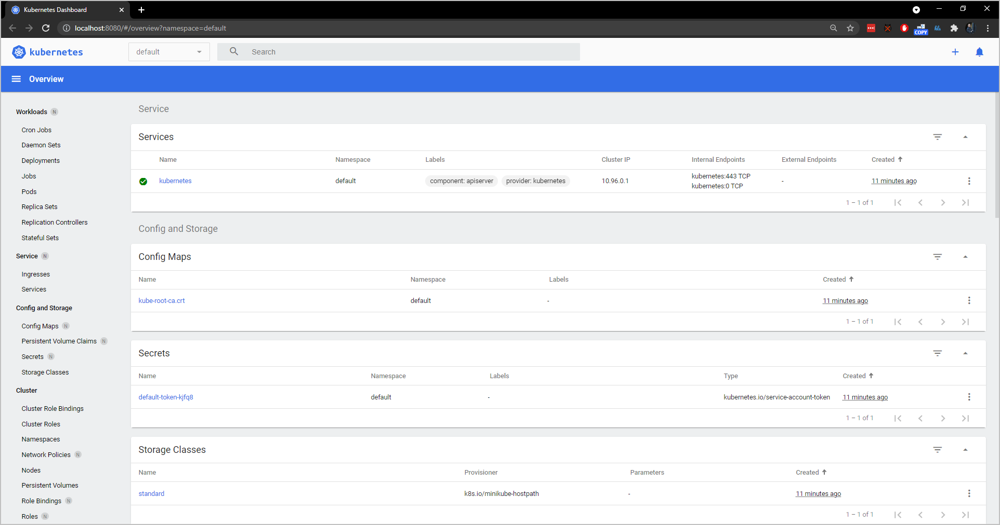

# Dashboard Deployment

1. Check the presence of dashboard in minikube's addons:

```console
$ minikube addons list
```

2. Enable (install) the kubernetes dashboard (Web UI) if it does not already:

```console
$ minikube addons enable dashboard
$ minikube addons enable metrics-server
```

3. Forward the port 8080 from host to access web UI inside cluster:

```console
$ kubectl port-forward --address 0.0.0.0 --namespace kubernetes-dashboard svc/kubernetes-dashboard 8080:80
```

☝️ While working, port-forwarding blocks your console until you press  `Ctrl+C`.

4. Open a browser and access it `http://localhost:8080`.

5. Stop port-forwarding by pressing `Ctrl+C`. Check whether do you still have connection or not.

6. You may leave or disable (delete) the dashboard service:

```console
$ minikube addons disable dashboard
```

## Solution

1. Check the presence of dashboard in minikube's addons:

```console
$ minikube addons list
|-----------------------------|----------|--------------|
|         ADDON NAME          | PROFILE  |    STATUS    |
|-----------------------------|----------|--------------|
| ambassador                  | minikube | disabled     |
| auto-pause                  | minikube | disabled     |
| csi-hostpath-driver         | minikube | disabled     |
| dashboard                   | minikube | disabled     |
| default-storageclass        | minikube | enabled ✅   |
| efk                         | minikube | disabled     |
| freshpod                    | minikube | disabled     |
| gcp-auth                    | minikube | disabled     |
| gvisor                      | minikube | disabled     |
| helm-tiller                 | minikube | disabled     |
| ingress                     | minikube | disabled     |
| ingress-dns                 | minikube | disabled     |
| istio                       | minikube | disabled     |
| istio-provisioner           | minikube | disabled     |
| kubevirt                    | minikube | disabled     |
| logviewer                   | minikube | disabled     |
| metallb                     | minikube | disabled     |
| metrics-server              | minikube | disabled     |
| nvidia-driver-installer     | minikube | disabled     |
| nvidia-gpu-device-plugin    | minikube | disabled     |
| olm                         | minikube | disabled     |
| pod-security-policy         | minikube | disabled     |
| registry                    | minikube | disabled     |
| registry-aliases            | minikube | disabled     |
| registry-creds              | minikube | disabled     |
| storage-provisioner         | minikube | enabled ✅   |
| storage-provisioner-gluster | minikube | disabled     |
| volumesnapshots             | minikube | disabled     |
|-----------------------------|----------|--------------|
```

2. Enable (install) the kubernetes dashboard (Web UI) if it does not already:

```console
$ minikube addons enable dashboard
    ▪ Using image kubernetesui/dashboard:v2.1.0
    ▪ Using image kubernetesui/metrics-scraper:v1.0.4
💡  Some dashboard features require the metrics-server addon. To enable all features please run:

        minikube addons enable metrics-server


🌟  The 'dashboard' addon is enabled

$ minikube addons enable metrics-server
    ▪ Using image k8s.gcr.io/metrics-server/metrics-server:v0.4.2
🌟  The 'metrics-server' addon is enabled
```

3. Forward the port 8080 from host to access web UI inside cluster:

```console
$ kubectl port-forward --address 0.0.0.0 --namespace kubernetes-dashboard svc/kubernetes-dashboard 8080:80
Forwarding from 0.0.0.0:8080 -> 9090
```

☝️ While working, port-forwarding blocks your console until you press  `Ctrl+C`.

4. Open a browser and access it `http://localhost:8080`.



5. Stop port-forwarding by pressing `Ctrl+C`. Check whether do you still have connection or not.

```console
$ kubectl port-forward --address 0.0.0.0 --namespace kubernetes-dashboard svc/kubernetes-dashboard 8080:80
Forwarding from 0.0.0.0:8080 -> 9090
Handling connection for 8080
...
Handling connection for 8080
```

6. You may leave or disable (delete) the dashboard service:

```console
$ minikube addons disable dashboard
    ▪ Using image kubernetesui/dashboard:v2.1.0
    ▪ Using image kubernetesui/metrics-scraper:v1.0.4
🌑  "The 'dashboard' addon is disabled
```
